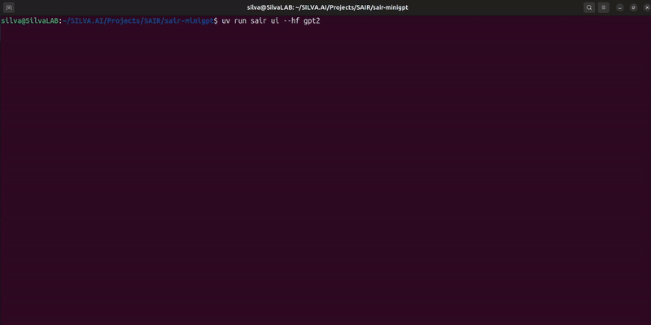
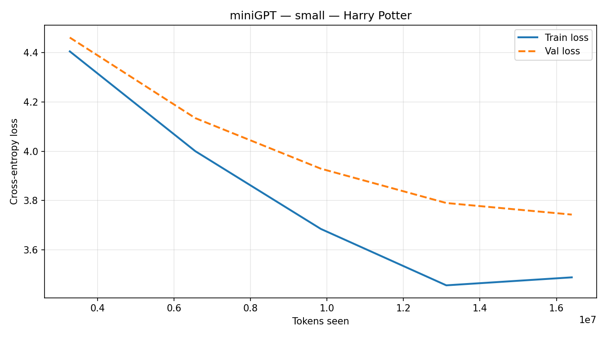

<p align="center">
  
</p>

<h1 align="center">SAIR miniGPT</h1>

<p align="center">
  <b>Build a GPT. Train it. Talk to it.</b><br/>
  A full-stack, hackable GPT playground — from raw text to a live web UI.
</p>

<p align="center">
  <a href="https://github.com/SAIR-Org/SAIR_Jr/tree/main/5_GPT%20from%20scratch">
    
  </a>
  
  
  
  
</p>

---

## 📹 Demo

<p align="center">
  
</p>

<p align="center">
  <i>Train → Generate → Chat — all in one system</i>
</p>

---

> **Capstone project for [SAIR Jr. — Module 5: GPT from Scratch](https://github.com/SAIR-Org/SAIR_Jr/tree/main/5_GPT%20from%20scratch).**
> Every function here (`GPTModel`, `generateV0`→`V3`, `trainerV3`, beam search) maps 1-to-1 to a notebook cell you already wrote.
> **Haven't finished the notebooks yet? Start there first — then come back here.**

---

## 🎯 What is this?

You built a GPT from scratch in Module 5. miniGPT packages all of that into a real, runnable system:

| Feature | What it does |
|---------|--------------|
| 🖥️ **`sair` CLI** | Go from raw text to trained model in a few commands |
| 📄 **Multi-format data** | `.txt` and `.pdf` files as training data |
| ☁️ **Flexible training** | Local CPU/GPU · Modal A100 cloud · multi-GPU DDP |
| 📊 **W&B + plots** | Live loss curves in your browser + PNG saved after training |
| 🌐 **Web UI** | Chat with your model in the browser |
| 🚀 **Pretrained models** | Load GPT-2 (124M → 1.5B) without training |

---

## 🗺️ Which path are you on?

**Choose one to get started:**

| | Path A — Train your own GPT | Path B — Use pretrained GPT-2 |
|---|---|---|
| **What you need** | Text or PDF files | Nothing — weights auto-download |
| **Time to first output** | Minutes (tiny) to hours (medium) | ~2 minutes |
| **Jump to** | [Step 1 below](#-step-1-install) | [Skip to Path B](#path-b--skip-training-load-pretrained-gpt-2) |

---

## Path A — Train your own GPT

### ⚡ Step 1 — Install

You need **Python 3.12+** and **uv** (fast Python package manager).

```bash
# Install uv if you don't have it
pip install uv

# Clone the repo
git clone https://github.com/SAIR-Org/miniGPT
cd miniGPT

# Set up the environment
uv sync
```

> ✅ You should see: `All packages installed. Resolved N packages.`
> All commands use `uv run sair ...` — works immediately without activating the venv.

---

### 🎛️ Step 2 — Pick your model size

Open **`config.py`** and set `MODEL_PRESET`:

```python
MODEL_PRESET = "small"    # ← change this line
```

| Preset | Params | Context | Best for |
|--------|--------|---------|----------|
| `tiny` | ~10 M | 256 tokens | No GPU — fast testing |
| `small` | ~50 M | 512 tokens | Laptop GPU or Modal free tier |
| `medium` | ~100 M | 1024 tokens | Dedicated GPU (8 GB+) |
| `custom` | you decide | you decide | [Custom architecture](#build-your-own-architecture) |

> **Not sure?** Start with `"small"` on Modal — it's fast and gives good results.

---

### 📂 Step 3 — Add your training data

```bash
cp my_book.txt  data/raw/      # .txt files work
cp my_paper.pdf data/raw/      # .pdf files work too
```

Any text works — novels, Wikipedia, research papers. More text = better model.

> **No data handy?** Download a free book from [Project Gutenberg](https://www.gutenberg.org).
>
> **Using Harry Potter books?** The SAIR repo has 6 of the 7 books (Book 2 — Chamber of Secrets is missing) at:
> `4_Applied Deep Learning with PyTorch/3_Sequence and NLP/harry_potter_txt/`
> Copy them with:
> ```bash
> cp "../4_Applied Deep Learning with PyTorch/3_Sequence and NLP/harry_potter_txt/"*.txt data/raw/
> ```

---

### 🔧 Step 4 — Tokenize

```bash
uv run sair prepare
```

Reads everything in `data/raw/`, strips formatting artifacts, tokenizes with GPT-2 tokenizer, saves to `data/processed/`.

Expected output for 6 Harry Potter books:
```
Loading corpus from data/raw ...
  [txt] Book 1 - The Philosopher's Stone.txt
  [txt] Book 3 - The Prisoner of Azkaban.txt
  ...
Total characters : 6,233,476

  train:  1,740,472 tokens  →  data/processed/train_ids.bin
  val  :    137,152 tokens  →  data/processed/val_ids.bin
  test :     56,651 tokens  →  data/processed/test_ids.bin

Done. Ready to train.
```

---

### 🚂 Step 5 — Train

**Option A — Local (CPU or GPU)**
```bash
uv run sair train
```
On CPU with `tiny` preset: ~5–10 min per epoch.

**Option B — Modal cloud GPU** *(recommended — see full guide below)*
```bash
uv run sair train --modal                        # via CLI
# or equivalently:
uv run python -m modal run train/modal_train.py  # direct
```

**Option C — Multi-GPU DDP**
```bash
uv run sair train --ddp              # uses all GPUs
uv run sair train --ddp --nproc 2    # specify count
```

---

### ☁️ Modal Cloud Training — Full Guide

[Modal](https://modal.com) gives you cloud GPU access with a free tier. Here's the complete setup we used in our live session.

#### 1. Create a Modal account

Go to `modal.com` and sign up with GitHub.

**Free tier:** You get **$5 immediately** (no card needed). Add a credit card to unlock the full **$30/month**. Credits reset monthly and don't roll over.

**GPU costs:**
| GPU | $/hr | 5 epochs on `small` model |
|-----|------|--------------------------|
| T4  | ~$0.59 | ~2–3 hrs → ~$1.50 |
| A100 | ~$3.70 | ~30–45 min → ~$2.50 |

> A100 is actually cheaper for this job because it finishes 4× faster.
> With only $5 (no card), **A100 still fits** — the run costs ~$2.50.

#### 2. Authenticate the CLI

```bash
uv run python -m modal token new
```

This opens your browser. Click approve and come back.

> ⚠️ **Use `uv run python -m modal`** everywhere instead of just `modal`.
> The `modal` binary in the venv has a broken shebang pointing to an old path.

#### 3. Set up W&B for live loss curves

Get your API key at `wandb.ai/authorize`, then:

```bash
uv run python -m modal secret create wandb-secret WANDB_API_KEY=your_key_here
```

#### 4. Launch training

```bash
uv run python -m modal run train/modal_train.py
```

Modal will:
- Build a Docker image with all dependencies (~2 min, cached after first run)
- Upload your code + tokenized data
- Spin up the GPU and start training
- Stream logs to your terminal in real time
- Print a W&B URL — open it to watch loss curves live

#### 5. Download your checkpoint

First, list what's in the volume to confirm:
```bash
uv run python -m modal volume ls sair-minigpt-checkpoints
```

Then download:
```bash
uv run python -m modal volume get sair-minigpt-checkpoints epoch_05.pt checkpoints/epoch_05.pt
uv run python -m modal volume get sair-minigpt-checkpoints loss_curve.png checkpoints/loss_curve.png
```

> ⚠️ Files are saved at the **root of the volume** (`epoch_05.pt`), not under `/checkpoints/epoch_05.pt`. Use the filename directly.

---

### 💬 Step 6 — Generate text

```bash
uv run sair generate "Once upon a time"
```

The CLI automatically loads the latest checkpoint from `checkpoints/`.

**Generation strategies:**

| Method | Command | Effect |
|--------|---------|--------|
| Nucleus (default) | `--method nucleus --temperature 0.9` | Natural, varied |
| Top-K | `--method top_k` | Sample from top K tokens |
| Greedy | `--method greedy` | Deterministic, repetitive |
| Beam search | `--beams 3` | Explores multiple paths |

**Additional flags:**
- `--temperature T` — `<1` more focused · `>1` more creative
- `--max-tokens N` — how many tokens to generate (default: 100)

---

### 🌐 Step 7 — Open the web UI

```bash
uv run sair ui
```

Then open **http://localhost:7860** in your browser.

> **No checkpoint?** Use `uv run sair ui --hf gpt2` (see Path B).

---

## 📊 Real Training Example — Harry Potter (5 epochs)

**Setup:** `small` preset (~50M params, 512 context) · Modal A100 · 6 Harry Potter books · 5 epochs

**Training run:** ~88 seconds/epoch on A100 · total ~$2.50

**Loss curve:**

<p align="center">
  
</p>

| Epoch | Train Loss | Val Loss |
|-------|-----------|---------|
| 1 | ~5.2 | ~5.4 |
| 2 | ~4.3 | ~4.5 |
| 3 | ~3.9 | ~4.1 |
| 4 | ~3.6 | ~3.8 |
| 5 | **3.49** | **3.74** |

Loss dropped consistently across all 5 epochs with a healthy train/val gap — no overfitting.

**W&B dashboard** (live curves during training):

```
wandb: Run history:
wandb:  train/loss █▅▃▁▁
wandb:    val/loss █▅▃▁▁
wandb:    train/lr █▇▅▃▁
```

**Generated samples after 5 epochs:**

```
Prompt: "Harry Potter walked into"

Harry Potter walked into the Phoenix - J. Rowling

"So it't you't let us if they't
him?" Harry said Mr. "Why
you know I mean ...'re going to kill me, he've got to
yourself.'t like your eyes."

"What did you have a bit to
Dumbledore" Harry.
```

```
Prompt: "Dumbledore looked at Harry and said"

Dumbledore looked at Harry and said.

"We're not have to do with a
for him." said Hagrid. "We'd be
you."

"I't you a week, but I's not know," said Harry,
and he said Sirius, but the ground.
```

The model picks up character names, dialogue structure, and Harry Potter vocabulary after just 5 epochs. Contractions are broken and sentences aren't fully coherent yet — that improves with more epochs.

**To improve results:**
- Bump `NUM_EPOCHS = 10` in `config.py` and retrain
- Use `--temperature 0.6` for more focused output
- Use `--max-tokens 200` for longer samples

---

## Path B — Skip training, load pretrained GPT-2

No data. No training. Start immediately:

```bash
git clone https://github.com/SAIR-Org/miniGPT
cd miniGPT
uv sync

# Generate instantly
uv run sair generate "The future of AI is" --hf gpt2

# Or open the full web UI
uv run sair ui --hf gpt2-medium
```

**Available variants:**

| Flag | Params | Notes |
|------|--------|-------|
| `--hf gpt2` or `--hf gpt2-124m` | 124 M | Fastest, lightest |
| `--hf gpt2-medium` or `--hf gpt2-355m` | 355 M | Good balance |
| `--hf gpt2-large` or `--hf gpt2-774m` | 774 M | Needs 4 GB+ RAM |
| `--hf gpt2-xl` or `--hf gpt2-1558m` | 1.5 B | Needs 8 GB+ RAM |

Weights download automatically on first use and cache locally.

---

## 🔨 Build your own architecture

Edit the `"custom"` entry in `config.py`:

```python
MODEL_PRESET = "custom"

MODELS["custom"] = {
    "vocab_size"    : 50257,   # keep this — matches GPT-2 tokenizer
    "context_length": 512,     # tokens the model sees at once
    "emb_dim"       : 384,     # embedding size
    "n_heads"       : 6,       # attention heads (emb_dim divisible by this)
    "n_layers"      : 6,       # number of transformer blocks
    "drop_rate"     : 0.1,     # dropout regularization
    "qkv_bias"      : False,   # True matches official GPT-2
}
```

> **Rule of thumb:** Doubling both `emb_dim` and `n_layers` roughly 4× the parameter count.

---

## 📁 Project structure

Every file is short, readable, and self-contained:

```
miniGPT/
├── config.py               ← all hyperparams — start here
├── cli.py                  ← sair prepare | train | generate | ui
│
├── data/
│   ├── prepare.py          ← reads .txt + .pdf, cleans, tokenizes, saves .bin
│   └── dataset.py          ← GPT2Dataset + DataLoader
│
├── model/
│   └── gpt.py              ← GPTModel: LayerNorm → MHA → FFN → Block
│
├── train/
│   ├── trainer.py          ← trainerV3: grad accumulation + cosine LR + W&B + plots
│   ├── ddp_trainer.py      ← trainerV4: DistributedDataParallel
│   └── modal_train.py      ← trainerV3 wrapped for Modal cloud GPU
│
├── inference/
│   ├── generate.py         ← generateV0 (greedy) → V3 (beam search)
│   └── load_weights.py     ← HuggingFace GPT-2 weight loading
│
├── ui/
│   ├── server.py           ← FastAPI backend
│   └── index.html          ← SAIR-branded dark web UI
│
└── tests/                  ← 39 tests covering full pipeline
```

---

## 📈 W&B + Matplotlib integration

Training automatically logs to [Weights & Biases](https://wandb.ai) and saves a loss plot.

**What gets logged:**
- Every eval step: `train/loss`, `val/loss`, `learning_rate`, `tokens_seen`
- Every epoch: generated text sample as W&B artifact
- After training: loss curve PNG uploaded to W&B + saved to `checkpoints/loss_curve.png`

**To disable W&B** (train without logging):

```python
# in train/trainer.py, change the default:
def train(..., use_wandb=False):
```

Or just don't create the `wandb-secret` on Modal — training falls back silently.

---

## 🎓 Design philosophy — intentionally hackable

miniGPT is deliberately **not** DRY (Don't Repeat Yourself).

- `trainer.py`, `ddp_trainer.py`, and `modal_train.py` each contain their own full training loop
- `generate.py` has four versions — `generateV0` through `V3` — each adding one idea

**Why?**
- **Each file is self-contained** — read, edit, or break any one without touching others
- **Each version is a learning step** — want to understand beam search? Read `generateV3`
- **No abstraction hides the detail** — see the full picture in every file

For a production-grade LLM system with clean architecture, see:

> **[MyLLM](https://github.com/silvaxxx1/MyLLM)** — optimized LLM system from scratch, designed for students ready to go beyond the playground.

---

## 🧪 Testing

```bash
uv run python -m pytest tests/ -v
```

```
============================= test session starts ==============================
collected 39 items

tests/test_config.py .....                                              [ 12%]
tests/test_data.py ......                                               [ 28%]
tests/test_generate.py .............                                    [ 61%]
tests/test_model.py ......                                              [ 76%]
tests/test_server.py .....                                              [ 89%]
tests/test_trainer.py .....                                             [100%]

39 passed in 8.65s
```

---

## 🐛 Known gotchas

| Problem | Fix |
|---------|-----|
| `modal: command not found` | Use `uv run python -m modal` instead of `modal` |
| `modal.Mount has no attribute` | Modal v1.x removed `Mount` — use `image.add_local_dir()` |
| `No such file or directory` when downloading checkpoint | Files are at volume root — use `epoch_05.pt` not `/checkpoints/epoch_05.pt` |
| Checkpoint corrupted on load | Re-download: `modal volume get sair-minigpt-checkpoints epoch_05.pt checkpoints/epoch_05.pt` |
| Model generates `Page \| 548 Harry Potter...` | Run `uv run sair prepare` again — `prepare.py` now strips page headers automatically |

---

## 🙏 Acknowledgements

- [SAIR Jr. — Module 5: GPT from Scratch](https://github.com/SAIR-Org/SAIR_Jr/tree/main/5_GPT%20from%20scratch) — the course this project implements
- Raschka, *Build a Large Language Model From Scratch*, Manning 2024
- Vaswani et al., *Attention Is All You Need*, NeurIPS 2017

---

## 📄 License

MIT — free for learning and building.

---

<p align="center">
  <b>Built with ⚡ and 🧠 by SAIR</b>
</p>
