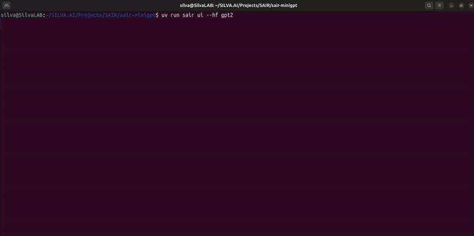

<p align="center">
  
</p>

<h1 align="center">SAIR miniGPT</h1>

<p align="center">
  <b>Build a GPT. Train it. Talk to it.</b><br/>
  A full-stack, hackable GPT playground — from raw text to a live web UI.
</p>

<p align="center">
  <a href="https://github.com/SAIR-Org/SAIR_Jr/tree/main/5_GPT%20from%20scratch">
    
  </a>
  
  
  
  
  
</p>

> 📌 **The official capstone of the [SAIR Jr. ML Engineering Track](https://github.com/SAIR-Org/SAIR_Jr)** — bottom-up, depth-first. Every function here (`GPTModel`, `generateV0`→`V3`, `trainerV3`, beam search) maps 1-to-1 to a notebook cell you already wrote in Module 5.

---

## ⚡ Quick Start — Modal Cloud Run (3 steps)

> For the full setup guide scroll to [Modal Cloud Training](#️-modal-cloud-training--full-guide).

```bash
# 1. Train on Modal A100 (~3 hrs, ~$12–15)
uv run python -m modal run train/modal_train.py::main

# 2. Download the final checkpoint to your machine
uv run python -m modal run train/modal_train.py::download

# 3. Launch the web UI and demo it live
uv run sair ui        # → http://localhost:7860
```

> **Why download?** Training runs on Modal's cloud GPU — the checkpoint lives there, not on your machine. Step 2 pulls it locally so the UI can load it.

---

## 🎯 Is This Project For You?

### ✅ **Build this if:**
- You've completed [Module 5: GPT from Scratch](https://github.com/SAIR-Org/SAIR_Jr/tree/main/5_GPT%20from%20scratch)
- You want to see your from-scratch GPT packaged as a real product
- You want hands-on experience with cloud GPU training (Modal)
- You want a portfolio-ready full-stack ML system

### 🚀 **Use pretrained mode (Path B) if:**
- You want to demo an LLM **right now** without training
- You're curious about the deployment side but not ready for the training side
- You need a working system to show someone in the next 5 minutes

> **⚠️ Haven't finished the notebooks yet?** Start with [Module 5](https://github.com/SAIR-Org/SAIR_Jr/tree/main/5_GPT%20from%20scratch) first — then come back here. miniGPT is the capstone, not the entry point.

---

## 📹 Demo

<p align="center">
  
</p>

*Live generation from a fine-tuned GPT-2 checkpoint running in the SAIR web UI.*

---

## 🎯 What is this?

You built a GPT from scratch in Module 5. miniGPT packages all of that into a real, runnable system:

| Feature | What it does |
| --- | --- |
| 🖥️ **`sair` CLI** | Go from raw text to trained model in a few commands |
| 📄 **Multi-format data** | `.txt` and `.pdf` files as training data |
| ☁️ **Flexible training** | Local CPU/GPU · Modal A100 cloud · multi-GPU DDP |
| 📊 **W&B + plots** | Live loss curves in your browser + PNG saved after training |
| 🌐 **Web UI** | Chat with your model in the browser |
| 🚀 **Pretrained models** | Load GPT-2 (124M → 1.5B) without training |

---

## 🗺️ Which path are you on?

**Choose one to get started:**

|  | Path A — Train your own GPT | Path B — Use pretrained GPT-2 |
| --- | --- | --- |
| **What you need** | Text or PDF files | Nothing — weights auto-download |
| **Time to first output** | Minutes (tiny) to hours (medium) | ~2 minutes |
| **Jump to** | [Step 1 below](#-step-1--install) | [Skip to Path B](#path-b--skip-training-load-pretrained-gpt-2) |

---

## Path A — Train your own GPT

### ⚡ Step 1 — Install

You need **Python 3.12+** and **uv** (fast Python package manager).

```bash
# Install uv if you don't have it
pip install uv

# Clone the repo
git clone https://github.com/SAIR-Org/miniGPT
cd miniGPT

# Set up the environment
uv sync
```

> ✅ You should see: `All packages installed. Resolved N packages.`
> All commands use `uv run sair ...` — works immediately without activating the venv.

---

### 🎛️ Step 2 — Pick your model size

| Preset | Params | Context | Best for |
| --- | --- | --- | --- |
| `tiny` | ~10 M | 256 tokens | No GPU — fast testing |
| `small` | ~50 M | 512 tokens | Laptop GPU or Modal free tier ($5 credit) |
| `medium` | ~163 M | 1024 tokens | Modal A100 — best quality ($30 credit) |
| `custom` | you decide | you decide | [Custom architecture](#-build-your-own-architecture) |

> The param count includes the full vocabulary embedding table (50,257 × 768 ≈ 38M), which is why `medium` is 163M rather than the ~124M you might expect.

**For local training**, open `config.py` and set:

```python
MODEL_PRESET = "small"    # ← change this line
```

**For Modal cloud training**, the model is set directly in `train/modal_train.py` — `config.py` is ignored for cloud runs:

```python
config = MODELS["medium"]   # ← change this line in modal_train.py
```

> This separation is intentional — your local config stays lightweight while cloud runs use the bigger model.

---

### 📂 Step 3 — Add your training data

```bash
cp my_book.txt  data/raw/      # .txt files work
cp my_paper.pdf data/raw/      # .pdf files work too
```

Any text works — novels, Wikipedia, research papers. More text = better model.

> **No data handy?** Download a free book from [Project Gutenberg](https://www.gutenberg.org).
>
> **Public-domain suggestions:**
> - *Pride and Prejudice* — Jane Austen
> - *Moby Dick* — Herman Melville
> - *Frankenstein* — Mary Shelley
> - *The Complete Works of Shakespeare*
>
> All free, all legally safe for training.

---

### 🔧 Step 4 — Tokenize

```bash
uv run sair prepare
```

Reads everything in `data/raw/`, strips formatting artifacts, tokenizes with GPT-2 tokenizer, saves to `data/processed/`.

Expected output:

```
Loading corpus from data/raw ...
  [txt] pride_and_prejudice.txt
  [txt] moby_dick.txt
  ...
Total characters : 1,250,000

  train:  320,000 tokens  →  data/processed/train_ids.bin
  val  :   25,000 tokens  →  data/processed/val_ids.bin
  test :   10,000 tokens  →  data/processed/test_ids.bin

Done. Ready to train.
```

---

### 🚂 Step 5 — Train

**Option A — Local (CPU or GPU)**

```bash
uv run sair train
```

On CPU with `tiny` preset: ~5–10 min per epoch.

**Option B — Modal cloud GPU** *(recommended — see full guide below)*

```bash
uv run python -m modal run train/modal_train.py::main
```

**Option C — Multi-GPU DDP**

```bash
uv run sair train --ddp              # uses all GPUs
uv run sair train --ddp --nproc 2    # specify count
```

---

### ☁️ Modal Cloud Training — Full Guide

[Modal](https://modal.com) gives you cloud GPU access with a free tier. Here's the complete setup we used in our live session.

#### 1. Create a Modal account

Go to [modal.com](https://modal.com) and sign up with GitHub.

**Free tier:** You get **$5 immediately** (no card needed). Add a credit card to unlock the full **$30/month**. Credits reset monthly and don't roll over.

**GPU costs:**

| GPU | $/hr | 30 epochs on `medium` model |
| --- | --- | --- |
| T4 | ~$0.59 | ~8–10 hrs → ~$6 |
| A100 | ~$3.70 | ~3 hrs → ~$12–15 |

> A100 is actually cheaper for large runs because it finishes 3–4× faster.

#### 2. Authenticate the CLI

```bash
uv run python -m modal token new
```

This opens your browser. Click approve and come back.

> ⚠️ **Use `uv run python -m modal`** everywhere instead of just `modal`.
> The `modal` binary in the venv has a broken shebang pointing to an old path.

#### 3. Set up W&B for live loss curves

Get your API key at [wandb.ai/authorize](https://wandb.ai/authorize), then:

```bash
uv run python -m modal secret create wandb-secret WANDB_API_KEY=your_key_here
```

#### 4. Launch training

> ⚠️ **Always specify the entrypoint explicitly.** The file has multiple entrypoints, so Modal requires `::name` syntax.

```bash
uv run python -m modal run train/modal_train.py::main
```

Modal will:

* Build a Docker image with all dependencies (~2 min, cached after first run)
* Upload your code + tokenized data
* Spin up the GPU and start training
* Stream logs to your terminal in real time
* Print a W&B URL — open it to watch loss curves live

#### 5. Download your checkpoint

```bash
# List all checkpoints in the Modal volume (with sizes)
uv run python -m modal run train/modal_train.py::list_checkpoints

# Download the latest checkpoint + loss_curve.png
uv run python -m modal run train/modal_train.py::download

# Download a specific checkpoint (e.g. epoch_26.pt)
uv run python -m modal run train/modal_train.py::download_specific
```

| Entrypoint | What it does |
| --- | --- |
| `::list_checkpoints` | Prints every file in the Modal volume with its size — useful to verify what's there before downloading |
| `::download` | Downloads the **latest** `epoch_XX.pt` + `loss_curve.png` to your local `checkpoints/` folder |
| `::download_specific` | Downloads `epoch_26.pt` specifically — edit the `filename` line in `modal_train.py` to target a different epoch |

> **Large checkpoints (~1.9 GB for `medium`):** the download streams chunks directly to disk, so it won't run out of memory regardless of file size.

---

### 🔁 Training from scratch vs. resuming a run

These are two different workflows — make sure you're using the right one.

#### Train from scratch (default)

Starts with random weights. Use this when:

* You're training for the first time
* You changed the model size (e.g. `small` → `medium`) — **you must start fresh if the architecture changes**
* You want a clean run with no prior history

`modal_train.py` does this by default — it builds a new `GPTModel` and calls `train()` with no `resume_from`.

#### Resume from a checkpoint

Picks up where a previous run left off — same model weights, same optimizer state, same LR schedule. Use this when:

* Training was interrupted and you want to continue
* You trained 5 epochs and want 5 more **on the same model size**

To resume, pass the checkpoint path to `train()`:

```python
train(
    model        = model,
    ...
    resume_from  = "/checkpoints/epoch_05.pt",  # ← picks up from epoch 6
    num_epochs   = 10,                           # ← total target epochs (not additional)
)
```

> ⚠️ **You cannot resume across model sizes.** If you trained a `small` checkpoint and switch to `medium`, the weight shapes are incompatible — start fresh.

The checkpoint format saves everything needed to resume:

```python
{"epoch": 5, "model": model.state_dict(), "optimizer": optimizer.state_dict()}
```

---

### 💬 Step 6 — Generate text

```bash
uv run sair generate "Once upon a time"
```

The CLI automatically loads the latest checkpoint from `checkpoints/`.

**Generation strategies:**

| Method | Command | Effect |
| --- | --- | --- |
| Nucleus (default) | `--method nucleus --temperature 0.9` | Natural, varied |
| Top-K | `--method top_k` | Sample from top K tokens |
| Greedy | `--method greedy` | Deterministic, repetitive |
| Beam search | `--beams 3` | Explores multiple paths |

**Additional flags:**

* `--temperature T` — `<1` more focused · `>1` more creative
* `--max-tokens N` — how many tokens to generate (default: 100)

---

### 🌐 Step 7 — Open the web UI

```bash
uv run sair ui          # loads your trained checkpoint from checkpoints/
uv run sair ui --hf gpt2   # loads pretrained GPT-2 instead (no checkpoint needed)
```

Then open **http://localhost:7860** in your browser.

**What weights does it use?**

* By default (`uv run sair ui`) → loads the **latest `epoch_XX.pt`** from your local `checkpoints/` folder
* With `--hf` flag → loads pretrained **GPT-2 from HuggingFace** (auto-downloads on first use)

> **`MODEL_PRESET` doesn't need to match your checkpoint for inference.** The loader reads the architecture directly from the checkpoint's saved weights, so `sair ui` and `sair generate` always use the correct model size automatically.

> **No checkpoint yet?** Either run training first, or use `--hf gpt2` to demo with pretrained weights immediately.

---

## 📊 Real Training Example — Public-Domain Corpus

### Run 1 — small model, 5 epochs (quick test)

**Setup:** `small` preset (~50M params, 512 context) · Modal A100 · public-domain novels · 5 epochs

**Cost:** ~$2.50 · ~88 sec/epoch

| Epoch | Train Loss | Val Loss |
| --- | --- | --- |
| 1 | ~5.2 | ~5.4 |
| 2 | ~4.3 | ~4.5 |
| 3 | ~3.9 | ~4.1 |
| 4 | ~3.6 | ~3.8 |
| 5 | **3.49** | **3.74** |

**Generated sample after 5 epochs:**

```
Prompt: "The stranger walked into"

The stranger walked into the room - and the door
of the house. "I cannot see, I am not," said he, "but
the man who had been a great deal more than the same."
```

The model picks up dialogue structure, punctuation, and vocabulary after just 5 epochs. Sentence coherence improves significantly with more epochs and a bigger model.

---

### Run 2 — medium model, 30 epochs (full run)

**Setup:** `medium` preset (~163M params, 1024 context) · Modal A100 · public-domain corpus · 30 epochs

**Cost:** ~$12–15 · ~3 hrs total

This is the recommended run for best output quality. The larger context window (1024 tokens) lets the model learn longer-range structure — multi-sentence paragraphs, consistent style, and dialogue flow.

**Loss curve** — from the last epoch checkpoint run (saved to `checkpoints/loss_curve.png`):

<p align="center">
  
</p>

**To get the best output:**

* Use `--temperature 0.7` for focused, in-style text
* Use `--max-tokens 200` for longer samples
* Use `--method nucleus` (default) for natural variation

---

## Path B — Skip training, load pretrained GPT-2

No data. No training. Start immediately:

```bash
git clone https://github.com/SAIR-Org/miniGPT
cd miniGPT
uv sync

# Generate instantly
uv run sair generate "The future of AI is" --hf gpt2

# Or open the full web UI
uv run sair ui --hf gpt2-medium
```

**Available variants:**

| Flag | Params | Notes |
| --- | --- | --- |
| `--hf gpt2` or `--hf gpt2-124m` | 124 M | Fastest, lightest |
| `--hf gpt2-medium` or `--hf gpt2-355m` | 355 M | Good balance |
| `--hf gpt2-large` or `--hf gpt2-774m` | 774 M | Needs 4 GB+ RAM |
| `--hf gpt2-xl` or `--hf gpt2-1558m` | 1.5 B | Needs 8 GB+ RAM |

Weights download automatically on first use and cache locally.

---

## 🚀 Path C — Fine-Tuning Facilities

Adapt your base or pre-trained models to perform dedicated tasks using instruction fine-tuning or sequence classification pipelines.

### 🧠 1. Instruction Fine-Tuning

Transform your pre-trained model into an instruction-following assistant using formatted dataset objects inside the `instruction-follower-data/` folder. This option loads a targeted backbone variant, initializes sequence data token loaders, and updates model capabilities over a cloud-scale infrastructure using an NVIDIA A100 GPU.

#### 📂 Adding your Instruction Data

To add your instruction dataset, place a JSON file named exactly **`instrution-data.json`** inside the `instruction-follower-data/` directory. The framework's `split_and_get_loaders` routine will automatically target this directory, run `data_split()` to handle cross-validation partitions, and prepare the text pairs for the token loaders.

#### Cloud Optimization via CLI

Execute, track, or download your training checkpoints via the remote configuration file `train/modal_train.py`:

```bash
# Verify architecture modifications and trainable parameters locally
uv run python finetune/instructure_follower_finetuning.py

# Launch instruction fine-tuning on a remote Modal A100 GPU
uv run python -m modal run train/modal_train.py::main

# List all instruction checkpoints and their sizes on the persistent storage volume
uv run python -m modal run train/modal_train.py::list_checkpoints

# Download the latest instruction checkpoint + loss curves to your local environment
uv run python -m modal run train/modal_train.py::download

# Pull down a specific target checkpoint from your remote workspace volume
uv run python -m modal run train/modal_train.py::download_specific
```

---

### 📊 2. Classification Fine-Tuning

Adapt the pre-trained model framework for sequence evaluation tasks (e.g., classifying text as spam or ham using the data file `classification_data/SMSSpamCollection.csv`).

The scripting framework `classification_finetuning.py` isolates, transforms, and optimizes components via the following architecture:

* **Layer Freezing:** Freezes all baseline feature blocks across the structural base architecture.
* **Head Replacement:** Swaps the default causal language modeling language head layer (`out_head`) for a distinct classification target output mapping (`Linear(emb_dim, num_classes)`).
* **Targeted Unfreezing:** Safely unfreezes the last transformer sequence layer block (`trf_blocks[-1]`) and the final layer normalization engine (`final_norm`) to provide efficient parameter updating.

#### 📂 Adding your Classification Data

To provide classification inputs, add your dataset format (e.g., a comma- or tab-separated structure like the default text classification corpus) into the `classification_data/` directory. When running the routine, `get_classification_dataloaders()` references your configuration variables to read the raw tracking file and tokens are extracted into the `data/classification-processed/` output bucket.

#### Cloud Optimization via CLI

Manage and track your classification algorithms through the execution backbone `finetune/modal_classification_train.py`:

```bash
# Verify architecture modifications and trainable parameters locally
uv run python finetune/classification_finetuning.py

# Launch text classification training pipelines on Modal cloud nodes (20 epochs, LR=5e-5)
uv run python -m modal run finetune/modal_classification_train.py

# Check current saved models, metrics, and data outputs across your cloud storage
uv run python -m modal run finetune/modal_classification_train.py::list_checkpoints

# Fetch the best performing saved model state weights (best_model.pt) locally
uv run python -m modal run finetune/modal_classification_train.py::download
```

#### Launch Fine-Tuning Web App

Deploy an isolated classification web dashboard to evaluate predictions inside your local browser setup:

```bash
uv run python ui_finetune/server.py
```

---

## 🔨 Build your own architecture

Edit the `"custom"` entry in `config.py`:

```python
MODEL_PRESET = "custom"

MODELS["custom"] = {
    "vocab_size"    : 50257,   # keep this — matches GPT-2 tokenizer
    "context_length": 512,     # tokens the model sees at once
    "emb_dim"       : 384,     # embedding size
    "n_heads"       : 6,       # attention heads (emb_dim divisible by this)
    "n_layers"      : 6,       # number of transformer blocks
    "drop_rate"     : 0.1,     # dropout regularization
    "qkv_bias"      : False,   # True matches official GPT-2
}
```

> **Rule of thumb:** Doubling both `emb_dim` and `n_layers` roughly 4× the parameter count.

---

## 📁 Project structure

Every file is short, readable, and self-contained:

```
miniGPT/
├── config.py                    ← all hyperparams — start here
├── cli.py                       ← sair prepare | train | generate | ui
├── pyproject.toml               ← dependencies
├── instruction_data.json        ← root-level instruction data
├── sair_gpt_demo.gif            ← demo animation (shown above)
│
├── classification_data/
│   └── SMSSpamCollection.csv    ← dataset for classification tasks
│
├── instruction-follower-data/
│   ├── example.json
│   ├── instrution-data.json     ← main instruction dataset (note: typo preserved)
│   ├── train.json
│   ├── val.json
│   └── test.json
│
├── data/
│   ├── prepare.py               ← reads .txt + .pdf, cleans, tokenizes, saves .bin
│   ├── dataset.py               ← GPT2Dataset + DataLoader
│   ├── testing_data.py          ← test utilities
│   ├── raw/                     ← your source text files
│   ├── processed/               ← tokenized .bin files
│   └── classification-processed/ ← classification CSV splits
│
├── finetune/
│   ├── classification_finetuning.py       ← transforms model layers & swaps heads
│   ├── classification_finetuning.ipynb    ← notebook version
│   ├── fine_tune.ipynb                    ← general fine-tuning notebook
│   ├── instructure_follower_finetuning.py ← loads instruction data components
│   ├── instructure_modal_train.py         ← remote instruction engine
│   └── modal_classification_train.py      ← cloud spam classification
│
├── model/
│   └── gpt.py                   ← GPTModel: LayerNorm → MHA → FFN → Block
│
├── train/
│   ├── trainer.py               ← trainerV3: grad accum + cosine LR + W&B + plots
│   ├── ddp_trainer.py           ← trainerV4: DistributedDataParallel
│   └── modal_train.py           ← trainerV3 wrapped for Modal cloud GPU
│
├── inference/
│   ├── generate.py              ← generateV0 (greedy) → V3 (beam search)
│   └── load_weights.py          ← HuggingFace GPT-2 weight loading
│
├── ui/
│   ├── server.py                ← FastAPI backend
│   ├── index.html               ← SAIR-branded dark web UI
│   └── SAiR_logo.jpg
│
├── ui_finetune/
│   ├── server.py                ← fine-tuning FastAPI backend
│   ├── index.html               ← dashboard for checking fine-tuning models
│   └── SAiR_logo.jpg
│
├── checkpoints/                 ← local checkpoints (gitignored)
│   ├── epoch_XX.pt
│   └── loss_curve.png
│
└── tests/                       ← 39 tests covering full pipeline
    ├── conftest.py
    ├── test_classification.py
    ├── test_config.py
    ├── test_data.py
    ├── test_generate.py
    ├── test_instructure_follower_finetuning.py
    ├── test_model.py
    ├── test_server.py
    └── test_trainer.py
```

---

## 📈 W&B + Matplotlib integration

Training automatically logs to [Weights & Biases](https://wandb.ai) and saves a loss plot.

**What gets logged:**

* Every eval step: `train/loss`, `val/loss`, `learning_rate`, `tokens_seen`
* Every epoch: generated text sample as W&B artifact
* After training: loss curve PNG uploaded to W&B + saved to `checkpoints/loss_curve.png`

**To disable W&B** (train without logging):

```python
# in train/trainer.py, change the default:
def train(..., use_wandb=False):
```

Or just don't create the `wandb-secret` on Modal — training falls back silently.

---

## 🎓 Design philosophy — intentionally hackable

miniGPT is deliberately **not** DRY (Don't Repeat Yourself).

* `trainer.py`, `ddp_trainer.py`, and `modal_train.py` each contain their own full training loop
* `generate.py` has four versions — `generateV0` through `V3` — each adding one idea

**Why?**

* **Each file is self-contained** — read, edit, or break any one without touching others
* **Each version is a learning step** — want to understand beam search? Read `generateV3`
* **No abstraction hides the detail** — see the full picture in every file

For a production-grade LLM system with clean architecture, see:

> **[MyLLM](https://github.com/silvaxxx1/MyLLM)** — optimized LLM system from scratch, designed for students ready to go beyond the playground.

---

## 🧪 Testing

```bash
uv run python -m pytest tests/ -v
```

```
============================= test session starts ==============================
collected 39 items

tests/test_config.py .....                                              [ 12%]
tests/test_data.py ......                                               [ 28%]
tests/test_generate.py .............                                    [ 61%]
tests/test_model.py ......                                              [ 76%]
tests/test_server.py .....                                              [ 89%]
tests/test_trainer.py .....                                             [100%]

39 passed in 8.65s
```

---

## 🐛 Known gotchas

| Problem | Fix |
| --- | --- |
| `modal: command not found` | Use `uv run python -m modal` instead of `modal` |
| `Specify a Modal Function or local entrypoint` | Always use `::main`, `::download`, `::download_specific`, or `::list_checkpoints` — the file has multiple entrypoints so Modal requires explicit `::name` syntax |
| `modal.Mount has no attribute` | Modal v1.x removed `Mount` — use `image.add_local_dir()` |
| `CUDA out of memory` locally | Your local GPU is too small for `medium` — run on Modal A100 instead |
| Resumed run but loss jumped up | You changed `MODEL_PRESET` between runs — weight shapes are incompatible for resuming, start fresh |
| `size mismatch` on `sair ui` or `sair generate` | This shouldn't happen anymore — the loader auto-detects arch from the checkpoint. If you see it, your checkpoint may be from a very old version; re-download from Modal |
| Model generates `Page \| 548 ...` | Run `uv run sair prepare` again — `prepare.py` now strips page headers automatically |

---

## 🤝 Get Help & Connect

Stuck on setup? Confused by Modal? Want to share your trained model?

[](https://t.me/+jPPlO6ZFDbtlYzU0)

Join the SAIR community for:
- ☁️ Help with Modal cloud setup and GPU training
- 💬 Code reviews of your fine-tuned models
- 🎯 Feedback on generated samples
- 📚 Deep dives into transformer internals

---

## 👥 Contributors

### 🏗️ Founding Team

miniGPT was originally designed and built by:

<table>
<tr>
<td align="center" width="220px">
<a href="https://github.com/silvaxxx1">
<br/>
<sub><b>Mohammed Awad Ahmed (Silva)</b></sub>
</a><br/>
<sub>Project Lead &amp; Architect</sub><br/>
<sub><em>SAIR Jr. Track Lead</em></sub>
</td>
<td align="center" width="220px">
<a href="https://github.com/SAIR-Org">
<br/>
<sub><b>SAIR Community</b></sub>
</a><br/>
<sub>Contributing Students</sub><br/>
<sub><em>Built during the 2025–2026 Cohort</em></sub>
</td>
</tr>
</table>

### 💎 All Contributors

Every student who has contributed to miniGPT — code, tests, documentation, or improvements:

<a href="https://github.com/SAIR-Org/miniGPT/graphs/contributors">
  
</a>

<br/>
<br/>

**Want your name here?** Fix a bug, add a test, improve the docs, or submit a feature.
---

## 🙏 Acknowledgements

* [SAIR Jr. — Module 5: GPT from Scratch](https://github.com/SAIR-Org/SAIR_Jr/tree/main/5_GPT%20from%20scratch) — the course this project implements
* Raschka, *Build a Large Language Model From Scratch*, Manning 2024
* Vaswani et al., *Attention Is All You Need*, NeurIPS 2017

---

## 📄 License

MIT — free for learning and building.

---

<p align="center">
  <em>Part of the <a href="https://github.com/SAIR-Org/SAIR_Jr">SAIR Jr. ML Engineering Track</a> 🇸🇩</em>
</p>
